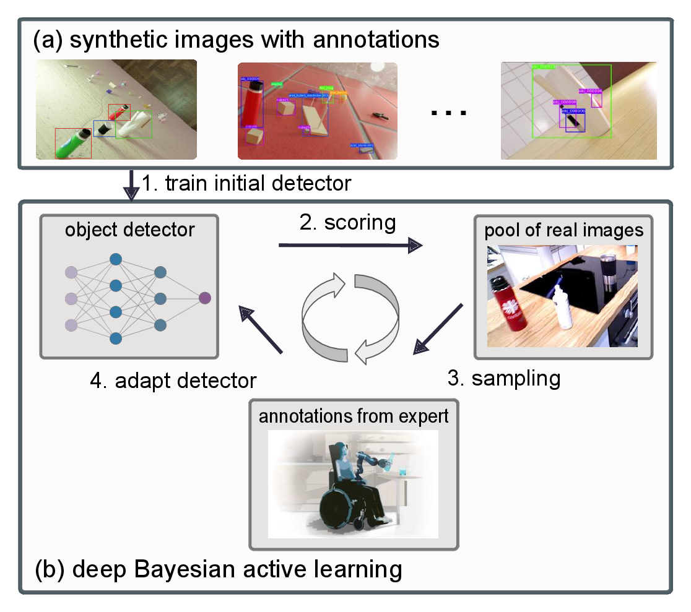

# Bayesian Active Learning for Sim-to-Real Robotic Perception

Jianxiang Feng, Jongseok Lee, Maximilian Durner and Rudolph Triebel

Accepted at IROS 2022. [Paper](https://arxiv.org/abs/2109.11547)

### Citation

If you find our work useful for your research, please consider citing

```
@inproceedings{feng2022bayesian,
  title={Bayesian Active Learning for Sim-to-Real Robotic Perception},
  author={Jianxiang Feng, Jongseok Lee and Durner, Maximilian and Triebel, Rudolph},
  booktitle={IROS},
  year={2022}
}
```

### Overview

<p align="center">

<p>


### Abstract
  While learning from synthetic training data has recently gained an increased attention, in real-world robotic applications, there are still performance deficiencies due to the so-called Sim-to-Real gap. 
  In practice, this gap is hard to resolve with only synthetic data. 
  Therefore, we focus on an efficient acquisition of real data within a Sim-to-Real learning pipeline. 
  Concretely, we employ deep Bayesian active learning to minimize manual annotation efforts and devise an autonomous learning paradigm to select the data that is considered useful for the human expert to annotate. 
  To achieve this, a Bayesian Neural Network (BNN) object detector providing reliable uncertainty estimates is adapted to infer the informativeness of the unlabeled data. 
  Furthermore, to cope with mis-alignments of the label distribution in uncertainty-based sampling, we develop an effective randomized sampling strategy that performs favorably compared to other complex alternatives. 
  In our experiments on object classification and detection, we show benefits of our approach and provide evidence that labeling efforts can be reduced significantly. 
  Finally, we demonstrate the practical effectiveness of this idea in a grasping task on an assistive robot.

## Prerequisites
It is recommended to install all required packages using conda:
Python version: 3.7.12 


```
conda env create -f environment.yml
```
Detectron2 (**v0.5**) requires extra build-from-source and installation (also can be installed with [pre-built versions](https://detectron2.readthedocs.io/en/v0.5/tutorials/install.html) depending on the CUDA&torch version):
  
  ```
  git clone https://github.com/facebookresearch/detectron2.git 
  cd detectron2
  git checkout v0.5
  python -m pip install -e .
  ```

Activate virtual environment:
  ```
  conda activate probdet
  ```
## Data sets
  
  ### Digit data-set
  
   Create a folder to store digits data, e.g.:
   ```
    export DIGITS_DATA_SET_PATH="./digits_data"
   ``` 
  
  ### YCBV data-set
  The link for downloading sim data: https://bop.felk.cvut.cz/media/data/bop_datasets/ycbv_train_pbr.zip
  
  Customized splits of real data: https://www.dropbox.com/s/pv4s4pjynf2874s/ycbv_test_train_real_sim_data.zip?dl=0
  
  ```
  mv ycbv_train_pbr/train_pbr/* ycbv_test_train_real_sim_data/ycbv_train_pbr_annotations/merged # after uncompression of the two files above
  ```
  
## Structure
```
├── mnist_AL_sim2real # classifcation from mnist to mnist-m
├── probdet_AL_sim2real # 2D object detection from synthetic images to real ones (since we don't plan to release the Edan and Sam data-sets, therefore the code serves only as an example for YCBV data-set)
```
  
## Instructions 
  
  ### Training on Simulation Dataset
  #### Classification
 ```
  ./mnist_AL_sim2real/train_net.sh
 ``` 
  #### Objcet Detection
 ```
  ./probdet_AL_sim2real/train_net.sh
 ``` 

  ### Active Learning on Real Dataset
  #### Classification
 ```
  ./mnist_AL_sim2real/start_AL.sh
 ``` 
  
  #### Objcet Detection
 ```
  ./probdet_AL_sim2real/start_AL.sh
 ``` 

  ##### AL Experiment Folder Sctructure
  After running with the command above, a folder with a structure below for storing information in active learning will be created in the output directory of the selected `INITIAL_CONFIG` in the AL config file.
  
  ```
  ├── acq5_iter10_rnd1_eval5_lr0.001_RANDOM_uni_test
  │   ├── al_results.json                         # a list of al results from each iteration
  │   ├── config.yaml                             # full config file    
  │   ├── iter1                                   # folder for storing info for each iter
  │   │   ├── inference                           # full config file
  │   │   │   ├── coco_instances_results.json     # outputs of the model trained from this iteration
  │   │   │   ├── instances_predictions.pth       
  │   │   │   └── selected_json_files
  │   │   │       ├── pool_set_iter2.json         # the pool data set for the next iteration
  │   │   │       └── selected_data_iter2.json    # selected data to be added in training set for the next iteration
  │   │   ├── last_checkpoint
  │   │   ├── metrics.json                        # evalutation results of the model trained from this iteration 
  │   │   └── model_final.pth                     # the trained model obtained from early stopping
  │   ├── iter10
  │   ├── iter2
  │   ├── iter3
  │   ├── iter4
  │   ├── iter5
  │   ├── iter6
  │   ├── iter7
  │   ├── iter8
  │   ├── iter9
  │   ├── log.txt                                 # all logging info
  │   ├── pretrained_selected                     # the pool data set and selected data for the first iteration
  │   └── YCBV_al_acq5_iter10_lr1e-3_uni_test.yaml # al config file 
  ```


  ### Testing
  
  #### Objcet Detection
 ```
  ./probdet_AL_sim2real/test_net.sh # test initially trained models
 ``` 
  
  
 ```
  ./probdet_AL_sim2real/eval_al_net.sh # test al trained models
 ``` 
  
## Acknowledgement
Probdet: https://github.com/asharakeh/probdet;
  
Batach-bald: https://github.com/BlackHC/BatchBALD.
